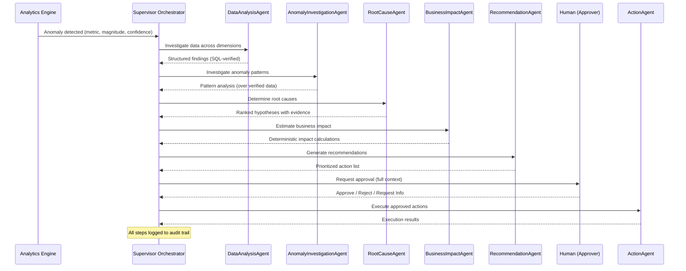

# ORION — System Architecture

## 1. Architecture Overview

ORION follows a **layered architecture** with strict separation between data
access, deterministic analytics, agent reasoning, and human-facing interfaces.

```
┌──────────────────────────────────────────────────────────────────────┐
│                        PRESENTATION LAYER                          │
│                   Next.js / TypeScript / Tailwind                  │
│                                                                      │
│  ┌────────────┐ ┌─────────────┐ ┌──────────┐ ┌──────────────────┐  │
│  │ Dashboard  │ │Investigation│ │ Approval │ │   Audit Trail    │  │
│  │  Overview  │ │   Detail    │ │   Queue  │ │     Viewer       │  │
│  └────────────┘ └─────────────┘ └──────────┘ └──────────────────┘  │
└──────────────────────────────┬───────────────────────────────────────┘
                               │  REST API + WebSocket (SSE)
┌──────────────────────────────▼───────────────────────────────────────┐
│                          API LAYER                                   │
│                     FastAPI (Python 3.11+)                           │
│                                                                      │
│  ┌──────────────┐ ┌──────────────┐ ┌──────────────┐ ┌────────────┐ │
│  │  /anomalies  │ │/investigations│ │  /approvals  │ │  /audit    │ │
│  └──────┬───────┘ └──────┬───────┘ └──────┬───────┘ └─────┬──────┘ │
└─────────┼────────────────┼────────────────┼────────────────┼────────┘
          │                │                │                │
┌─────────▼────────────────▼────────────────▼────────────────▼────────┐
│                       SERVICE LAYER                                  │
│                                                                      │
│  ┌─────────────────┐  ┌─────────────────┐  ┌────────────────────┐  │
│  │  Analytics       │  │  Investigation  │  │   Approval &       │  │
│  │  Engine          │  │  Orchestrator   │  │   Action Engine    │  │
│  │                  │  │                 │  │                    │  │
│  │ • Anomaly detect │  │ • Pipeline mgmt │  │ • Approval queue   │  │
│  │ • Stat. analysis │  │ • Agent dispatch│  │ • Action execution │  │
│  │ • Impact calc    │  │ • Result merge  │  │ • Audit logging    │  │
│  └────────┬─────────┘  └────────┬────────┘  └─────────┬──────────┘  │
└───────────┼─────────────────────┼──────────────────────┼────────────┘
            │                     │                      │
┌───────────▼─────────────────────▼──────────────────────▼────────────┐
│                        AGENT LAYER                                   │
│              (Provider-Agnostic Interface)                           │
│                                                                      │
│  ┌───────────────────────────────────────────────────────────────┐  │
│  │                    SupervisorAgent                             │  │
│  │          Coordinates the investigation pipeline               │  │
│  └──┬──────────┬──────────┬──────────┬──────────┬───────────┬───┘  │
│     │          │          │          │          │           │        │
│  ┌──▼───┐  ┌──▼───┐  ┌──▼───┐  ┌──▼───┐  ┌──▼────┐  ┌──▼────┐  │
│  │Data  │  │Anomaly│  │Root  │  │Impact│  │Recomm.│  │Action │  │
│  │Analys│  │Invest.│  │Cause │  │Estim.│  │Engine │  │Engine │  │
│  └──┬───┘  └──┬───┘  └──┬───┘  └──┬───┘  └──┬────┘  └──┬────┘  │
└─────┼─────────┼─────────┼─────────┼──────────┼──────────┼───────┘
      │         │         │         │          │          │
┌─────▼─────────▼─────────▼─────────▼──────────▼──────────▼───────┐
│                        MCP TOOL LAYER                             │
│            (Model Context Protocol tool server)                   │
│                                                                    │
│  ┌──────────┐ ┌──────────┐ ┌──────────┐ ┌──────────┐            │
│  │ Revenue  │ │ Support  │ │Inventory │ │ Customer │ ...        │
│  │  Tools   │ │  Tools   │ │  Tools   │ │  Tools   │            │
│  └────┬─────┘ └────┬─────┘ └────┬─────┘ └────┬─────┘            │
└───────┼────────────┼────────────┼────────────┼──────────────────┘
        │            │            │            │
┌───────▼────────────▼────────────▼────────────▼──────────────────┐
│                      DATA LAYER                                  │
│               SQLAlchemy ORM + Raw SQL                          │
│                                                                  │
│  ┌────────────────────────────────────────────────────────────┐  │
│  │                    PostgreSQL                              │  │
│  │                                                            │  │
│  │  orders · products · customers · support_tickets          │  │
│  │  inventory · campaigns · anomalies · investigations       │  │
│  │  approvals · actions · audit_logs                         │  │
│  └────────────────────────────────────────────────────────────┘  │
└──────────────────────────────────────────────────────────────────┘
```

## 2. Layer Responsibilities

### 2.1 Presentation Layer (Frontend)

| Component            | Purpose                                          |
|----------------------|--------------------------------------------------|
| Dashboard Overview   | Real-time business health metrics and alerts     |
| Investigation Detail | Step-by-step investigation timeline with evidence|
| Approval Queue       | Pending actions requiring human approval         |
| Audit Trail Viewer   | Searchable, filterable history of all decisions  |

**Technology**: Next.js 14+ (App Router), TypeScript, Tailwind CSS

**Communication**: REST API for CRUD operations, Server-Sent Events (SSE)
for real-time investigation progress updates.

### 2.2 API Layer (Backend)

FastAPI application exposing versioned REST endpoints:

```
/api/v1/
├── /anomalies           # CRUD + trigger detection
├── /investigations      # Start, monitor, query investigations
├── /investigations/{id}/timeline  # Investigation step timeline
├── /approvals           # Approval queue management
├── /actions             # Action execution status
├── /audit               # Audit log queries
├── /metrics             # Business metrics data
└── /health              # System health check
```

### 2.3 Service Layer

The service layer contains all business logic and enforces the critical
principle: **deterministic calculations first, agent reasoning second**.

```python
# CORRECT: Agent receives pre-computed data
revenue_data = analytics_engine.compute_revenue_decline(period)
# revenue_data = {"decline_pct": -23.4, "onset_date": "2024-01-15", ...}
agent_analysis = agent.reason_over(revenue_data)

# WRONG: Agent generates its own numbers
agent_analysis = agent.analyze_revenue()  # ← NEVER DO THIS
```

#### Analytics Engine
- Anomaly detection using statistical methods (z-score, IQR, time-series)
- Revenue trend calculation
- Customer retention/churn analysis
- Support SLA compliance scoring
- Inventory health scoring
- All outputs are deterministic and reproducible

#### Investigation Orchestrator
- Manages the investigation pipeline lifecycle
- Dispatches work to agents in the correct order
- Merges results from multiple agents into a coherent investigation
- Handles failures and retries

#### Approval & Action Engine
- Maintains the approval queue
- Enforces approval policies (who can approve what)
- Executes approved actions through action handlers
- Logs every state transition to the audit trail

### 2.4 Agent Layer

Provider-agnostic agent interfaces. Each agent is defined as an abstract
Python class with:

- **Input schema**: Pydantic model defining what data the agent receives
- **Output schema**: Pydantic model defining what the agent must produce
- **Tool access**: List of MCP tools the agent may invoke
- **Reasoning boundary**: Clear definition of what the agent reasons about
  vs. what it receives as pre-computed data

See [AGENTS.md](./AGENTS.md) for detailed agent specifications.

### 2.5 MCP Tool Layer

Business tools exposed via Model Context Protocol so that:
- Agents can discover and invoke tools programmatically
- External systems (including Adya) can discover ORION's capabilities
- Tool definitions serve as a contract between agents and business logic

See [MCP_TOOLS.md](./MCP_TOOLS.md) for tool specifications.

### 2.6 Data Layer

PostgreSQL database with SQLAlchemy ORM.

#### Core Business Tables

```sql
-- Transactional data (synthetic dataset)
orders(id, customer_id, product_id, region, quantity, unit_price,
       total_amount, status, order_date, fulfilled_date)

products(id, name, category, sku, unit_cost, list_price, status)

customers(id, name, email, segment, region, first_order_date,
          lifetime_value, status)

inventory(id, product_id, warehouse_region, quantity_on_hand,
          reorder_point, last_restock_date, snapshot_date)

support_tickets(id, customer_id, order_id, category, priority,
                status, created_at, first_response_at, resolved_at,
                satisfaction_score)

marketing_campaigns(id, name, channel, start_date, end_date,
                    budget, spend, impressions, clicks, conversions)
```

#### ORION System Tables

```sql
-- Anomaly detection
anomalies(id, metric_name, metric_value, expected_value, deviation,
          severity, detected_at, status)

-- Investigation tracking
investigations(id, anomaly_id, status, started_at, completed_at,
               summary, root_causes, confidence_score, impact_estimate)

investigation_steps(id, investigation_id, agent_name, step_order,
                    input_data, output_data, started_at, completed_at,
                    status)

-- Approval workflow
approval_requests(id, investigation_id, action_type, action_details,
                  requested_at, status, approved_by, decided_at,
                  decision_reason)

-- Action execution
action_executions(id, approval_id, action_type, parameters,
                  status, started_at, completed_at, result, error)

-- Audit trail
audit_logs(id, entity_type, entity_id, action, actor, details,
           timestamp)
```

## 3. Data Flow: Investigation Pipeline



## 4. Key Design Decisions

### 4.1 Why FastAPI + Next.js?
- **FastAPI**: Native async support, automatic OpenAPI docs, Pydantic
  validation, excellent for ML/data workloads
- **Next.js**: Server-side rendering for dashboard performance, App Router
  for modern React patterns, excellent TypeScript support

### 4.2 Why PostgreSQL?
- Rich analytical query support (window functions, CTEs)
- JSONB for flexible agent output storage
- Strong transactional guarantees for audit logging
- Battle-tested at scale

### 4.3 Why Provider-Agnostic Agent Interface?
- Adya integration is planned but not yet available
- Abstract interfaces allow development to proceed independently
- Adapter pattern means Adya integration is additive, not destructive
- Enables testing with mock implementations

### 4.4 Why MCP?
- Emerging standard for AI tool interoperability
- Allows Adya (and other systems) to discover ORION tools automatically
- Clean separation between tool definition and agent orchestration
- Future-proofs the architecture

### 4.5 Why Deterministic Analytics First?
- LLMs cannot be trusted to generate accurate numerical data
- Statistical calculations must be reproducible and auditable
- Agent reasoning should interpret verified data, not fabricate it
- This makes the system auditable and trustworthy

## 5. Security & Governance

- **Authentication**: JWT-based auth for API access
- **Authorization**: Role-based access control (RBAC) for approval workflows
- **Audit**: Immutable append-only audit log for all state transitions
- **Data Isolation**: Synthetic data only in v1; production data access
  requires additional security review

See [GOVERNANCE.md](./GOVERNANCE.md) for detailed governance policies.

## 6. Deployment Architecture (Future)

```
┌─────────────────────────────────────────────┐
│              Container Orchestration         │
│                                             │
│  ┌──────────┐  ┌──────────┐  ┌──────────┐  │
│  │ Frontend │  │ Backend  │  │   MCP    │  │
│  │ (Next.js)│  │ (FastAPI)│  │  Server  │  │
│  └────┬─────┘  └────┬─────┘  └────┬─────┘  │
│       │              │              │        │
│  ┌────▼──────────────▼──────────────▼─────┐  │
│  │            PostgreSQL                  │  │
│  └────────────────────────────────────────┘  │
└─────────────────────────────────────────────┘
```

v1 runs locally with `docker-compose` or direct process execution.
Production deployment architecture will be defined after Adya integration.
