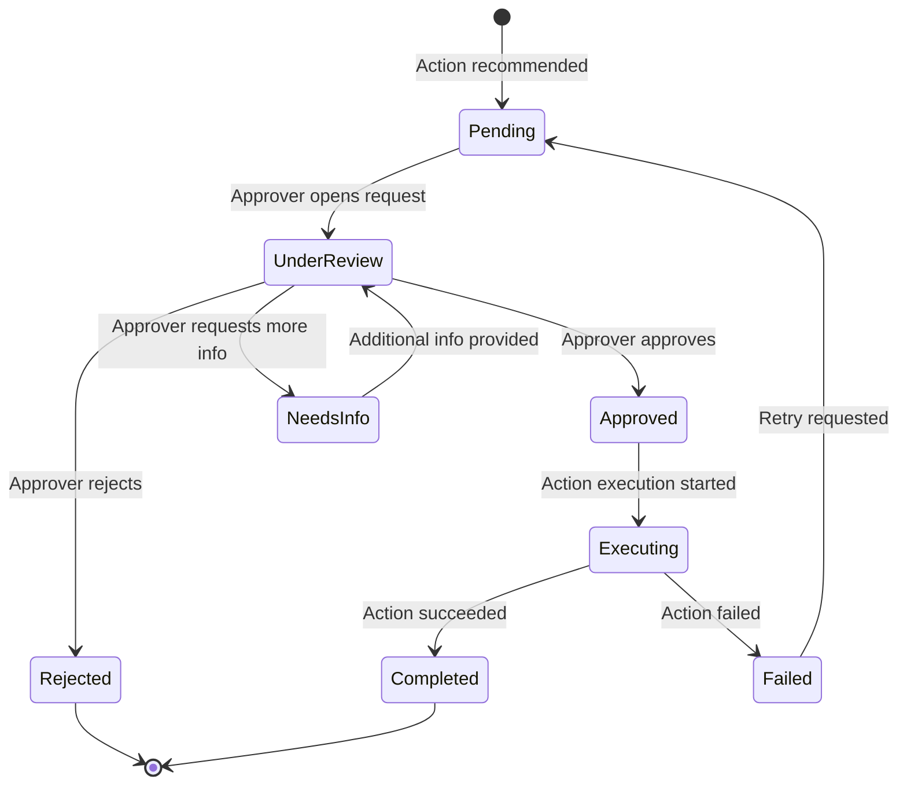

# ORION — Governance & Human-in-the-Loop Policy

## 1. Overview

ORION enforces a governance model where AI agents can detect, investigate,
and recommend — but **cannot act without human approval**. This document
defines the policies, roles, and workflows governing human oversight.

## 2. Core Governance Principles

1. **No autonomous consequential actions**: Any action that modifies business
   operations, allocates resources, or contacts customers requires explicit
   human approval.

2. **Full transparency**: Every AI decision, recommendation, and data source
   is visible and auditable. No black-box reasoning.

3. **Evidence-based decisions**: Approvers see the complete evidence chain —
   from raw data through analysis to recommendation — before deciding.

4. **Immutable audit trail**: Every detection, investigation step, approval
   decision, and action execution is permanently logged.

5. **Least privilege**: Agents have read-only access to business data. Write
   operations are gated through the approval workflow.

## 3. Roles & Permissions

| Role              | Can View | Can Approve | Can Configure | Can Admin |
|-------------------|----------|-------------|---------------|-----------|
| Viewer            | ✅        | ❌           | ❌             | ❌         |
| Analyst           | ✅        | ❌           | ✅             | ❌         |
| Approver          | ✅        | ✅           | ❌             | ❌         |
| Operations Lead   | ✅        | ✅           | ✅             | ❌         |
| Administrator     | ✅        | ✅           | ✅             | ✅         |

### Permission Details

- **View**: See dashboards, investigations, audit logs
- **Approve**: Approve or reject recommended actions
- **Configure**: Modify detection thresholds, agent parameters, notification rules
- **Admin**: Manage users, roles, system settings

## 4. Approval Workflow

### Approval Request Contents

Every approval request includes:

| Section             | Contents                                         |
|---------------------|--------------------------------------------------|
| Anomaly Summary     | What was detected, severity, onset date          |
| Investigation       | Full timeline of investigation steps             |
| Root Cause          | Ranked hypotheses with evidence                  |
| Business Impact     | Quantified realized and projected impact         |
| Recommended Action  | What the system proposes to do                   |
| Expected Outcome    | Projected improvement with confidence            |
| Risks               | Potential negative consequences                  |
| Alternatives        | Other options considered                         |
| Audit Context       | Who/what triggered this, full decision chain     |

### Approval Policies

| Action Category     | Required Approver Role | Timeout Policy         |
|---------------------|------------------------|------------------------|
| Staffing changes    | Operations Lead        | 24h escalation         |
| Inventory reorders  | Operations Lead        | 12h escalation         |
| Marketing changes   | Operations Lead        | 24h escalation         |
| Customer outreach   | Approver               | 24h escalation         |
| Management escalation| Auto-approved          | Immediate              |

## 5. Escalation Policy

If an approval request is not acted upon within the timeout period:

1. **First escalation**: Notification sent to all users with Approver role
2. **Second escalation** (2x timeout): Notification sent to Administrators
3. **Critical anomalies**: Escalation begins immediately, shorter timeouts

## 6. Audit Trail Requirements

### What is Logged

| Event Type           | Logged Fields                                    |
|----------------------|--------------------------------------------------|
| Anomaly detected     | metric, value, threshold, severity, timestamp    |
| Investigation started| investigation_id, anomaly_id, config, timestamp  |
| Agent step completed | agent, input_hash, output_hash, duration         |
| Recommendation made  | action_type, expected_impact, priority           |
| Approval requested   | action, approver_pool, timeout                   |
| Approval decided     | decision, approver_id, reason, timestamp         |
| Action executed      | action_type, parameters, result, duration        |
| Action failed        | error, rollback_status                           |

### Retention Policy
- Audit logs are retained indefinitely in v1
- Production deployment will define retention schedules per compliance needs

### Immutability
- Audit log table uses append-only pattern
- No UPDATE or DELETE operations on audit_logs table
- Application-level enforcement + database triggers

## 7. Data Access Controls

### Agent Data Access
- All agents have **read-only** access to business data
- Write operations are only performed by ActionAgent after approval
- Each agent's tool access is explicitly declared and enforced

### Sensitive Data
- Customer PII is accessible only through parameterized queries
- No PII appears in agent reasoning output or logs
- Synthetic dataset in v1 uses fictional customer data

## 8. Incident Response

If ORION itself malfunctions:

1. **Agent failure**: Investigation continues with available agents;
   partial results are flagged
2. **Database failure**: System enters read-only mode; no new investigations
3. **Complete outage**: Manual investigation procedures documented separately
4. **Security incident**: Admin can disable all agent execution immediately
